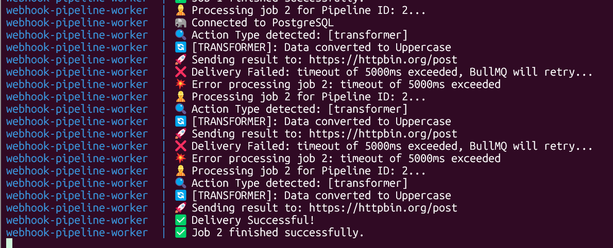
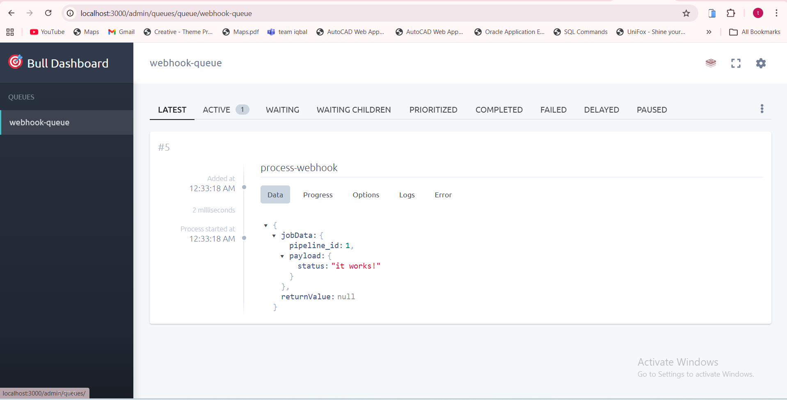

# 🚀 Robust Webhook Pipeline System

A high-performance, distributed webhook processing engine built with Node.js, BullMQ, and Docker. This system is architected for reliability, featuring asynchronous job processing, multi-stage data transformation, and secure delivery.
---

## 🏗️ Architecture Design

The system is designed as a Producer-Consumer architecture to ensure high availability and reliability:

- **API (Producer):** An Express.js gateway that validates incoming payloads and enqueues jobs into Redis.
- **Redis (Message Broker):** Orchestrates the job lifecycle using BullMQ for high-throughput queuing.
- **Worker (Consumer):** A specialized service that executes data processing (Transform/Filter/Enrich) and handles secure delivery.
- **PostgreSQL:** The source of truth for pipeline configurations and persistent job logs.

---

## 🛠️ DAdvanced Features & Design Decisions

**1. Reliability & Resilience**

- **Asynchronous Processing:**  
  API responses are near-instant, while heavy processing happens in the background.

- **Exponential Backoff:**  
  Built-in retry logic (3 attempts) with increasing delays to handle transient network failures gracefully.

- **Graceful Shutdown:**  
  The worker is designed to finish active jobs before shutting down during updates.

**2. Security & Integrity (The Polish) 🔐**

- **Webhook Signing:** Every outgoing request includes an `X-Webhook-Signature` header.

- **HMAC-SHA256:** Payloads are signed using a secret key, allowing subscribers to verify that the data is authentic and hasn't been tampered with.

**3. Observability**

- **Real-time Dashboard:** Integrated **BullBoard** at `/admin/queues` for monitoring job states (Waiting, Active, Completed, Failed).
- **Structured Logging:** Detailed logs for each stage of the pipeline (Action Detection -> Transformation -> Delivery).


---

## 🚀 Setup & Installation

### Prerequisites
- Docker & Docker Compose  
- Node.js (for local development)

### 1. Clone & Environment

Create a `.env` file based on the provided `.env.example`:

```env
cp .env.example .env
# Edit .env with your specific credentials
```

### 2. Run with Docker

The entire stack can be launched with a single command:

```bash
sudo docker compose up -d --build
```

## 📖 Usage Guide

### 1. Create a Pipeline

Define a new webhook endpoint and choose a `processor_type` (`transformer`, `filter`, or `enricher`):

```bash
curl -X POST http://localhost:3000/pipelines \
     -H "Content-Type: application/json" \
     -d '{
       "name": "Order Updates",
       "source_path": "order-updates",
       "processor_type": "enricher",
       "subscriber_url": "https://webhook.site/YOUR_UNIQUE_ID"
     }'
```
### 2. Trigger the Webhook

Send data to your unique path:

```bash 
curl -X POST http://localhost:3000/pipelines/order-updates \
     -H "Content-Type: application/json" \
     -d '{"order_id": "TAB-2026", "status": "shipped"}'
```
### 3. Monitor Logs

Watch the Worker process the job in real-time:

```bash 
sudo docker compose logs -f worker
```
## 📊 Monitoring

A dashboard is available to monitor queue health:

- **URL:** http://localhost:3000/admin/queues

## 🛠️ Tech Stack & Tools

- **Backend:** TypeScript, Express.js
- **Queue Management:** BullMQ, Redis
- **Database:** PostgreSQL (with Drizzle ORM)
- **DevOps:** Docker, GitHub Actions (CI/CD)
- **Security:** Crypto (HMAC-SHA256)
- **Monitoring:** BullBoard

---

## 📊 System Performance in Action

Here is a practical demonstration of how the system handles real-world scenarios, illustrating its robustness and observability.

### 🛡️ Resilience & Reliability (Worker Logs)



**Figure 1: Exponential Backoff & Automatic Retries.**
This image captures the moment the system encountered a temporary failure when calling the subscriber URL (`https://httpbin.org/post`). Notice how the system handled it:
1.  **Transient Failure:** The worker logs `Delivery Failed: timeout of 5000ms exceeded`.
2.  **Built-in Resilience:** BullMQ automatically enqueues the job for a retry using **Exponential Backoff**.
3.  **Final Success:** After two failed attempts, the network transient clears, and the third attempt succeeds (`✅ Delivery Successful!`). This demonstrates **Zero-Drop reliability** for the pipeline.

### 🔍 System Observability (Bull Dashboard)



**Figure 2: Job Lifecycle and Payload Visibility.**
This image shows the live dashboard at `localhost:3000/admin/queues`. It provides full transparency into the pipeline:
* **Active States:** The `ACTIVE` tab is selected, showing one job currently in processing.
* **Job Metadata:** The raw payload of the incoming webhook (`jobData`) is completely visible (Pipeline ID, Data: `it works!`).
* **Audit Trail:** Precise timestamps for when the job was added, started, and finished are provided for audit and debugging purposes.

---

